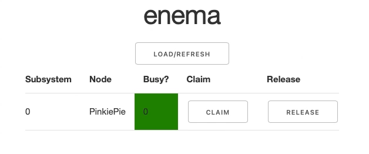

# Enema

Enema is a Resource Congestion Resolution Service. It's a very simple Python Web App with an API that can be used to detect resource availability in CI pipelines and help the CI runner decide which node has external resources necessary for testing available.

The primary use case is if your CI pipeline relies on scarce hardware resources available only under a few of the available CI runner nodes, e.g. if your application being tested relies on the presence of said hardware.

Enema presents you with a Web App interface where you can manually toggle which nodes are currently busy out of CI context and a REST API which lets you change the reported state of the nodes with any other application that might be sharing hardware layer access with your CI pipeline.

## Installation and deployment

The easiest way to deploy this is to use Heroku. The `Procfile` for Heroku is included and you can test the application locally with `heroku local`. You can use any WSIG Python server with the app

Before deploying you will need to:

1. Set the `DASH_APP_KEY` environment variable in the shell you're about to deploy in. The key should be a base64-encoded key (you can use `openssl rand -base64 32` to generate a safe one).

2. Run the app once, it will likely fail as the `auth` database is empty for now. But when you run the SQL schema will be executed and an `app.db` file will be created within the package folder.

3. Create users and passwords in the `auth` table:

    1. Run `python` and `from enema.crypto import encrypt_password`. Then use the `encrypt_password('some_password', 'your openssl rand key here')` to encrypt the password. Copy the encrypted string.

    2. Run `sqlite3 ./enema/app.db` and run the following SQL statement:

        ```sql
        INSERT INTO auth VALUES(0, 'user', 'encrypted password string here');
        -- the first value is a sequential user ID (0, 1, 2, ...)
        ```

    3. `.exit` the SQLite3 tool.

4. Now you should be able to re-run the application with the user-password authentication working. **If you decide to use this in production, make sure the server you deploy this on uses HTTPS connection to prevent man-in-the-middle attacks**.

## Usage

When you go to the web address where the Web App is deployed (`localhost:8050` in default development env), you will see an empty table after hitting the `Load/Refresh` button.

To add services to the table, for now it's only possible to do so by directly interacting with the SQLite `app.db` database and inserting values into the `subsystems` and `nodes` tables. `subsystems` contains information about hardware subsystems and maps with a foreign key to `nodes` table which contains details about the runners hosting these subsystems. (I am working on a panel where you can add, remove and edit the subystems via the web app to make it easier)

When the table is populated, each subsystem is displayed on a separate row with two buttons: `Claim` and `Release`. They are responsible for notifying the service that a particular subystem has been toggled to busy or free state respectively. When you click either of the buttons, you will see the `Busy` state going green or red and changing its value accordingly:



### API support

1. Use `openssl rand -base64 32` to generate an API token.

2. Encrypt the API token the same way you encrypted the user passwords, using `enema.crypto`'s `encrypt_password` function. Remember to set the `DASH_APP_KEY` variable prior to that.

3. Take the Fernet-encrypted string and copy it. Like with the user password you will need to add it to the database, this time to the `api_auth` table:

    ```sql
    INSERT INTO api_auth VALUES(0, 'user', 'encrypted token here')
    ```

4. When sending requests to the API make sure to add the original token value as a basic Authorization header, for example with `curl`:

    ```bash
    curl -X GET localhost:8050/nodes -H "Authorization: Basic $DASH_API_TOKEN"
    ```

    Note that the API token should be placed where the `$DASH_API_TOKEN` variable is. It's nice to use an env variable here for added opacity when sending requests with `curl`.

5. When sending `POST` requests make sure you're sending them with `Content-Type: application/json` header. Otherwise the requests won't get through. Of course for `POST` you need the `Authorization` header as well.

#### The API routes you may currently use

* `/status`
  * `GET` - retreives the complete list of all subsystems
* `/subsystem/status/<string:subsystem_id>`
  * `GET` - retrieves the current status of a system with a particular ID (hint: if you do know the name of a subsystem but don't know its ID, use `/status` route to find it).
  * `POST` - switches the status value for a given subsystem with a JSON request in the form of: `{"status": 1}`. Value 1 is for **busy** and value 0 is for **free**.
* `/nodes`
  * `GET` - retrieves the complete list of all nodes

More routes are coming soon along with more complete Web App interface.
